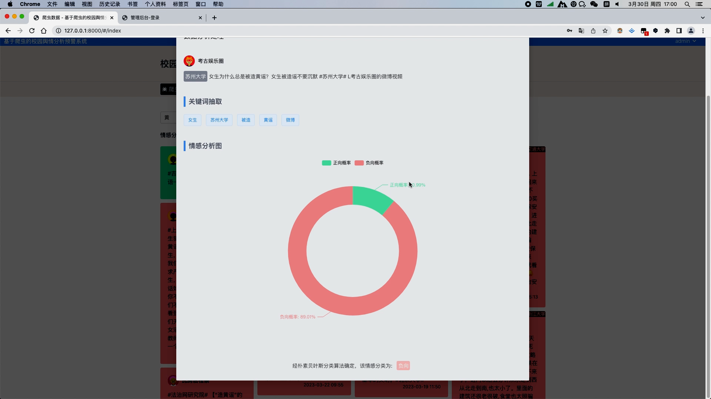
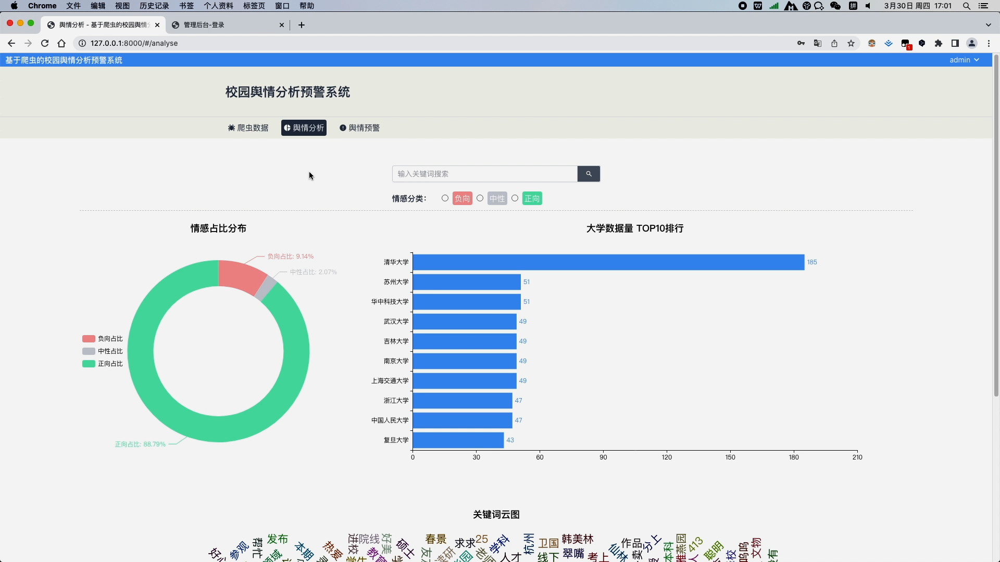
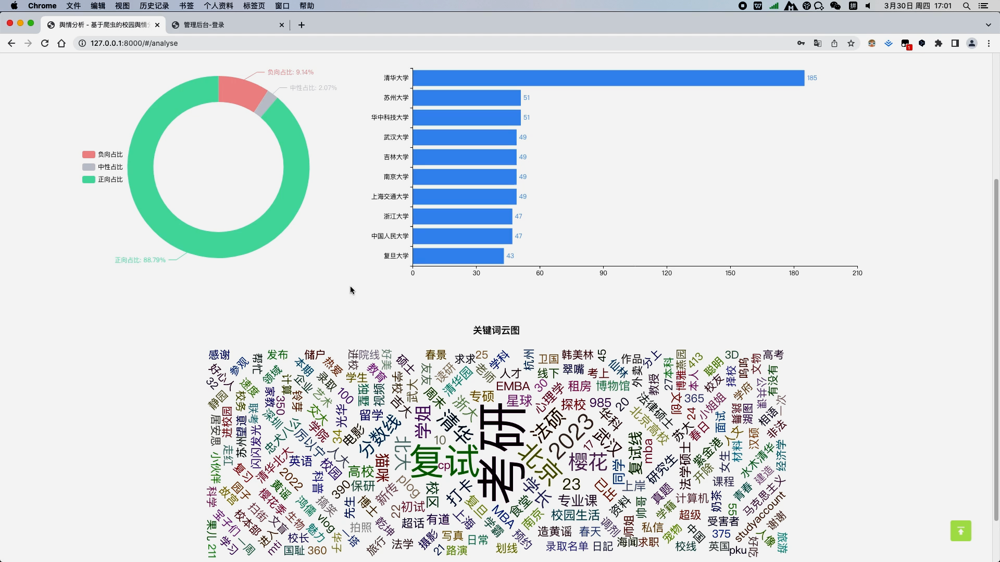
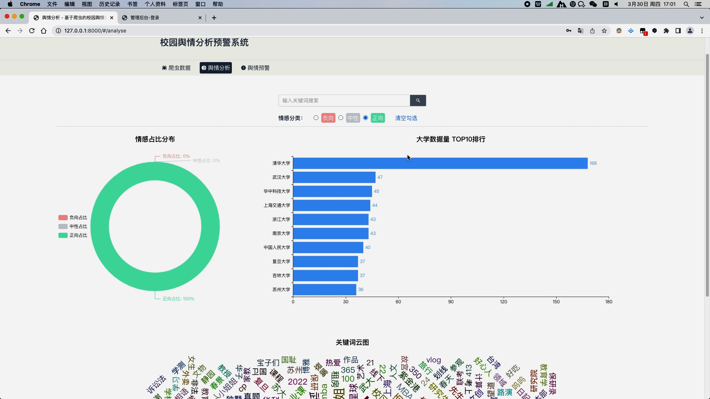
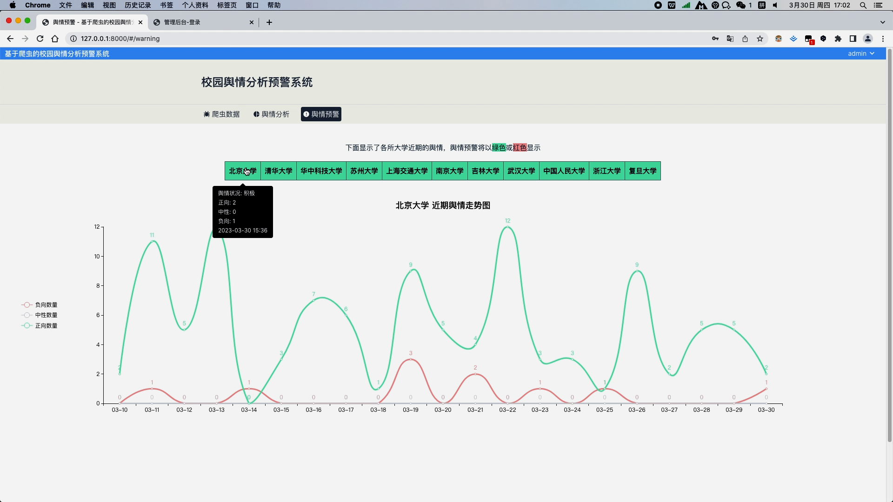
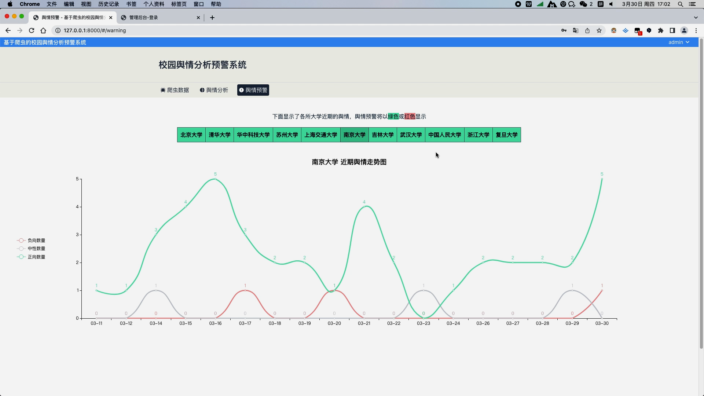
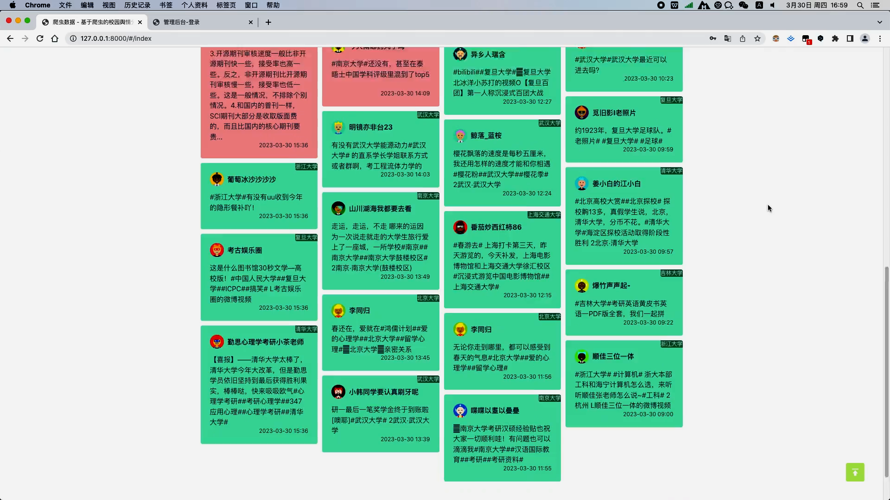
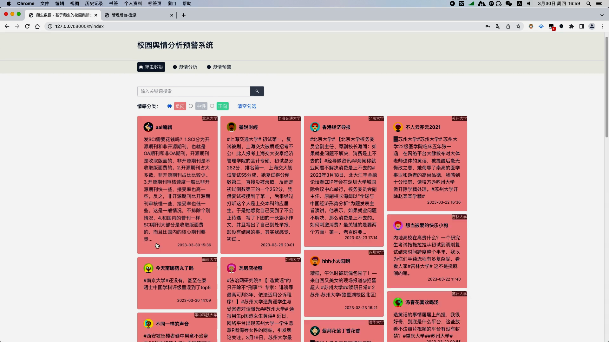
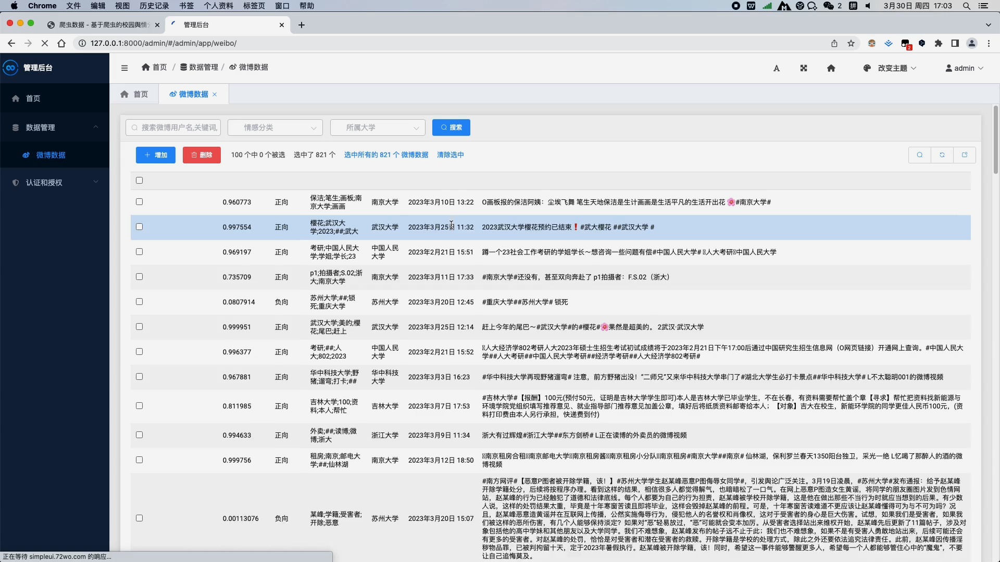

## 计算机毕业设计PySpark+Flask校园舆情分析 舆情预警 舆情分析系统 微博情感分析 自然语言处理 机器学习 深度学习 人工智能 大数据毕业设计 Hadoop 情感分析模型 朴素贝叶斯算法

## 要求
### 源码有偿！一套(论文 PPT 源码+sql脚本+教程)

### 
### 加好友前帮忙start一下，并备注github有偿纯python校园舆情
### 我的QQ号是2827724252或者798059319或者 1679232425或者微信:bysj2023nb 或bysj1688

# 

### 加qq好友说明（被部分 网友整得心力交瘁）：
    1.加好友务必按照格式备注
    2.避免浪费各自的时间！
    3.当“客服”不容易，repo 主是体面人，不爆粗，性格好，文明人。

演示视频
https://www.bilibili.com/video/BV1Rr421T7BA/?spm_id_from=333.999.0.0

### 核心技术以及功能介绍:
  1. python编程语言，Django后端框架，Scrapy爬虫框架
  2. javascript编程语言，Vue前端框架，Element-plus组件库，axios请求库，windicss样式库，echarts可视化
  3. 核心算法：朴素贝叶斯情感分类，当爬虫抓取数据进行入库时，会对文本进行分析，分类出正向/中性/负向三种类别的情感，并给出正向情感的概率
  4. 功能模块包括：

    a. 微博各所大学数据的展示与筛选查询，数据以瀑布流卡片形式展现，正向情感的文本用绿色背景，中性用灰色背景，负向以红色背景，方便用户一眼可以识别出该微博数据的情感倾向；
    当用户点击卡片时，弹出对话框，显示该微博数据的详细信息，以及信息的关键词，以及饼图分析正负向的情感概率占比
    b. 舆情分析模块，用饼图对数据库中所有的微博信息的情感占比进行分析，用柱状图对数据库中所有高校信息量进行top10排序分析，以及用词云图分析所有数据的关键词
    c. 舆情预警模块，列出了各所大学近期的舆情情况，舆情的好坏将以绿色背景或红色背景显示，点击某所大学的时候，可以以线图形式分析出近期该所大学的正负情感的走向，当某天负向情感数量大于正向情感时，将该大学舆情状况标注为坏，用红色背景显示，否则以绿色显示
